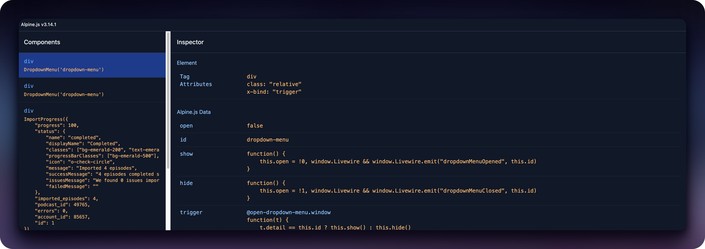

# Alpine.js Inspector

A Chrome DevTools extension for debugging Alpine.js V3 applications.



## Features

- 🔍 Inspect Alpine.js component state
- 🎯 Track component changes in real-time
- 🎨 Component highlighting in the page

## Installation

### From Chrome Web Store

1. This extension is not currently available on the Chrome Web Store.

### From latest GitHub release

1. See the [latest release](https://github.com/jtolj/alpinejs-inspector/releases/latest)
2. Download alpinejs-inspector.zip
3. Unzip and load the folder as an unpacked extension (see [instructions](https://developer.chrome.com/docs/extensions/get_started#unpacked))

### From source

1. Build the extension using `bun run build`
2. Load the `dist` folder as an unpacked extension (see [instructions](https://developer.chrome.com/docs/extensions/get-started/tutorial/hello-world#load-unpacked))
3. Open Chrome DevTools (F12 or Cmd+Option+I)
4. Find the new "Alpine.js" panel in DevTools

## Compatibility

- Works with Alpine.js v3.x only
- Built as a Manifest v3 Chrome extension

## Development

```bash
# Install entr
brew install entr # (or apt install entr, etc)

# Ensure node version
nvm install && nvm use

# Install dependencies
bun install

# Watch for development
bun run dev

# Build for production
bun run build
```

## Credits

Heavily inspired by the excellent [Alpine.js DevTools extension](https://github.com/alpine-collective/alpinejs-devtools)
